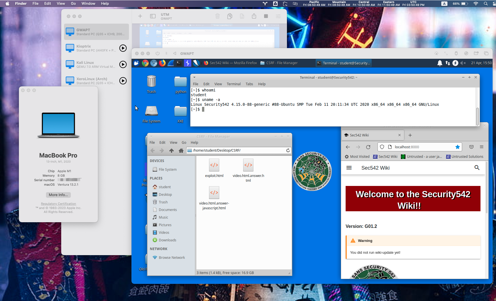

# Emulation on macOS via UTM

**Author:** David Boyd 
**Updated:** 2023-07-20

## Table of Contents

- [Introduction](#introduction)
- [Steps](#steps)
  - [1. Create a VM](#1-create-a-vm)
  - [2. Configure VM Settings](#2-configure-vm-settings)

## Introduction

This is really a proof of concept. That Apple's M1's AArch64 can emulate the x86-64 architecture.  This has been tested with the SANs SIFT VM and Kioptrix.  However, due to limited HW specs on my testing machine, the emulation suffers in terms of speed.  Large GUI applications can take more than 10 minutes to load... IF they even load at all.

Nonetheless, feel free to reach out to me if you've tested this on higher specs (especially with an M1 Pro/Max/Ultra) and how the emulation ran.  It'd be nice if this could be resolved; but until then, c'est la vie!

## Steps

### 1. Create a VM

1. In UTM, click `Create a New Virtual Machine` > `Emulate`
2. Regardless of OS, choose `Other`
3. Check `Skip ISO boot`

### 2. Configure VM Settings

The created VM's settings are going to need to match the VM we're importing. With **VMWare**, oftentimes an accompanying `.vmx` file will carry the information you need. If the `.vmx` or similar file is not available, you may be required to do some trial and error to properly get the VM up and running.

Example settings can be found for the [SANS GWAPT][gwapt-vm] and [Kioptrix][kioptrix-vm] VMs.

<!-- References -->
[gwapt-vm]: https://github.com/dboyd42/it-support/blob/master/Network%20and%20Systems%20Administration/Virtualization/UTM/GWAPT.md
[kioptrix-vm]: https://github.com/dboyd42/it-support/blob/master/Network%20and%20Systems%20Administration/Virtualization/UTM/kioptrix-level-1.md
