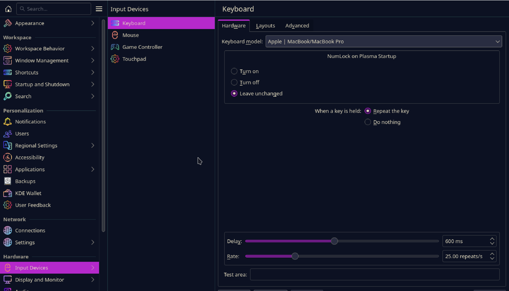
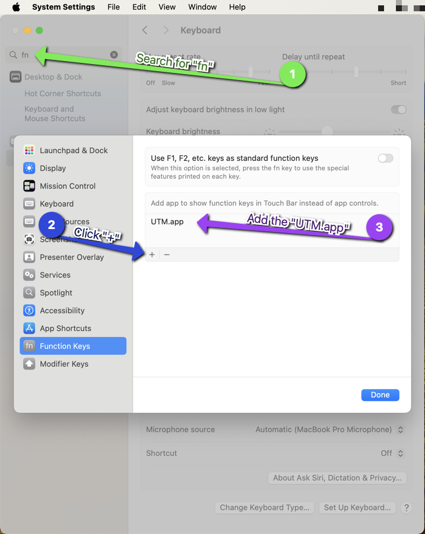

# How to Install Kali arm64 in macOS

**Author:** David Boyd<br>
**Date:** 2023-09-20

## Table of Contents

<!-- TODO: Create GenTocGFM -->

## Introduction

There are two methodologies into running Kali's arm64 on macOS using UTM. The
first is a quick and easy method that involves attaching a serial terminal and
installing Kali from there. The second, is installing a base Debian arm64
image, then installing Kali on top. Both have their advantages, but for the
purpose of this article, I'm only introducing the first method (for now).

## Prerequisites

1. Download and install [UTM][utm] 
2. Download the [Kali installer for Apple Silicon (ARM64)][kaliarm64] image.

<!--  TODO:

## Steps

### Step 1: *Title*

*[Provide a clear and concise explanation of the first step. Use bullet points
or subheadings if necessary.]*

### Step 2: *Title*

*[Explain the second step, breaking it down into smaller sub-steps if
applicable.]*

### Step 3: *Title*

*[Continue with the subsequent steps, ensuring clarity and logical flow.]*

-->

### Step 4: Fix the Keyboards

I came across two issues while running Kali. The first is that the `⌥` key
doesn't always register as the `alt` key. The second is that Touch Bar proves
useless, takes up valuable real estate, and creates added key presses to
run any function key. So we'll resolve these issues now.

#### Change Keyboard Layout

##### Method 1: Terminal

0. Check the current keyboard model:

``` bash
setxbhmap -query
```

1. List the available keyboard models for Apple

``` bash
egrep "apple|macbook" /usr/share/X11/xkb/rules/xorg.lst                       
```

2. Specify the desired keyboard model

:bulb: `macbook78` is equivalent to **Apple | MacBook/MacBook Pro**

``` bash
setxkbmap -model macbook78
```

##### Method 2: GUI Settings

The following steps are for a Plama desktop, but they're universally the same.

1. Open `Settings`
2. Navigate to `Hardware` > `Input Devices` > `Keyboard` > `Hardware`
3. Set the `Keyboard model:` to `Apple | MacBook/MacBook Pro`
4. Click `Apply` to save the settings.



#### Touch Bar to Function Keys

After digging through macOS's System Settings, there's a setting called
Function Keys that allow you convert to Touch Bar to the standard function keys
while running a specific set of apps. This allows the user to retain Touch Bar
functionality in everything but those apps!

1. Go to `System Settings`
2. Search for `fn`
3. Click `+` and select UTM *(usually found in `/Applications/UTM`)*
4. Click `Done`



<!-- TODO:

## Tips and Best Practices

*[Share any additional tips, best practices, or common pitfalls to help readers
achieve better results.]*

-->

<!-- TODO:

## Conclusion

*[Summarize the guide and reiterate the key points. Optionally, suggest next
steps or provide additional resources for readers to explore.]*

-->

<!-- TODO:

## Additional Resources

*[Include any relevant links or resources that can further assist readers in
their journey.]*

-->

<!-- Reference Links -->

[kaliarm64]: https://www.kali.org/get-kali/#kali-installer-images
[utm]: https://mac.getutm.app/
