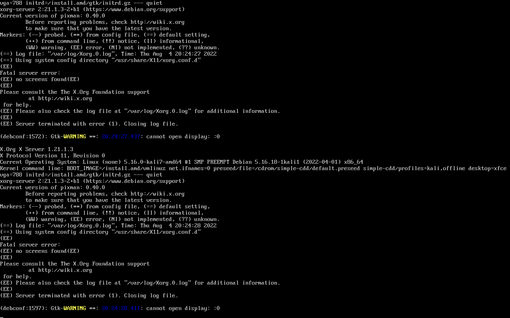

# Installing Kali in Virt-Manager

**Author:** David Boyd 
**Date:** 2023-09-29

## Table of Contents

## Troubleshooting

### No Display After Kali Install Screen

#### Current Setup:

|      |                                        |
|------|----------------------------------------|
| Date | 2023-09-29                             |
| OS   | Garuda (Arch)                          |
| CPU  | i7-1165G7                              |
| ISO  | kali-2022.4-everything.iso *(renamed)* |

#### The Problem

After the Kali ISO boots up, I select `Install` (tried both the graphical and
non-graphical). Then what appears are three lines at the bottom of the screen
stating that **Kali can't mount /dev/vda** and **media failed** to something
along the lines that it **can't unmount**. The proceeding screen is a loop of
logs that appears similar to the image below:

*Credit: [StackOverflow][so_display]*

#### The Fix

In the same [StackOverflow article][so_display], the fix is to set the display 
from `VirtIO` to `QXL` with the acceleration turned off before switching.

<!-- References -->

[so_display]: https://unix.stackexchange.com/questions/712474/trying-to-install-kali-linux-on-qemu-kvm-using-virt-manager-fails-on-no-displa

